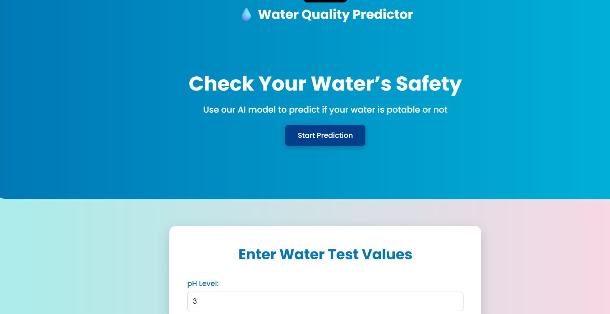

# 🌊 AI-Powered Water Quality Predictor (FNN-Based)

  

  <b>💧 Predict whether water is safe to drink using a custom Feedforward Neural Network (FNN) integrated with Flask and WHO standards 💧</b> 
  Built by <a href="https://github.com/tejeshwar-01">Tejeshwar Reddy</a>

---

## 🚀 Overview
This project is an **AI-powered web application** that predicts whether a given water sample is **safe or unsafe to drink** using a **Feedforward Neural Network (FNN)** built with **TensorFlow & Keras**.

It combines:
- A **deep learning FNN model** for prediction accuracy,  
- **Flask** for real-time web integration, and  
- **WHO water quality guidelines** for scientific validation.

The system offers an intuitive, colorful web interface that allows users to input 9 water-quality parameters and receive an instant AI-based safety prediction.

---

## 🧠 Core Highlights

✅ Custom-built **Feedforward Neural Network (FNN)**  
✅ WHO rule-based water safety validation  
✅ Flask backend for real-time predictions  
✅ Responsive modern UI (HTML, CSS, JS)  
✅ Interactive “Safe / Unsafe” result visualization  
✅ Trained using real-world **Water Potability Dataset**

---

## 🧩 Model Architecture — Feedforward Neural Network (FNN)

| Layer | Neurons | Activation | Description |
|:------|:----------|:-------------|:-------------|
| Dense (Input) | 64 | ReLU | Learns patterns from 9 numeric water parameters |
| Dense (Hidden) | 32 | ReLU | Captures non-linear relationships |
| Dense (Output) | 1 | Sigmoid | Outputs water safety probability (0 = Unsafe, 1 = Safe) |

**Optimizer:** Adam  
**Loss:** Binary Crossentropy  
**Metrics:** Accuracy, Precision, Recall, F1-Score  
**Early Stopping:** Enabled for optimal performance  

---

## 🧪 Training Workflow

1. **Load Dataset:** `water_potability.csv`  
2. **Clean Data:** Handle missing values  
3. **Normalize Inputs:** `MinMaxScaler`  
4. **Label Safety:** Based on WHO guidelines  
5. **Train Model:** FNN using TensorFlow/Keras  
6. **Save Artifacts:**  
   - `water_quality_model.h5` — Trained model  
   - `scaler.pkl` — Scaler for preprocessing  
   - `best_threshold.npy` — Optimized classification threshold  

---

## ⚙️ Tech Stack

| Layer | Technology |
|:------|:------------|
| **Frontend** | HTML5, CSS3 (animated gradients), JavaScript |
| **Backend** | Flask (Python) |
| **AI Model** | TensorFlow / Keras (Feedforward Neural Network) |
| **Data Processing** | Pandas, NumPy, Scikit-learn |
| **Deployment** | Render / Localhost |

---

## 💡 WHO Safety Standards

| Parameter | Safe Range | Unit |
|:-----------|:------------|:------|
| **pH** | 6.5 – 8.5 | — |
| **Hardness** | ≤ 500 | mg/L |
| **Solids** | ≤ 50,000 | mg/L |
| **Chloramines** | ≤ 4 | mg/L |
| **Sulfate** | ≤ 400 | mg/L |
| **Conductivity** | ≤ 2000 | µS/cm |
| **Organic Carbon** | 2.2 – 15 | mg/L |
| **Trihalomethanes** | ≤ 100 | µg/L |
| **Turbidity** | ≤ 5 | NTU |

⚠️ *If any value exceeds these limits → the water is considered unsafe.*

---

## 💻 Example Predictions

| Input Sample | AI Prediction |
|:--------------|:---------------|
| ph=7.3, Hardness=220, Solids=15000, Chloramines=2.5, Sulfate=250, Conductivity=1500, Organic Carbon=10, Trihalomethanes=60, Turbidity=3 | 💧 **Water is Safe** |
| ph=5.5, Hardness=700, Solids=60000, Chloramines=5, Sulfate=500, Conductivity=2500, Organic Carbon=20, Trihalomethanes=120, Turbidity=8 | ⚠️ **Water is Not Safe** |

---

## 🧾 License
Licensed under the **MIT License** — free to use, modify, and distribute with attribution.

---
---
 LIVE WEBSITE : https://waterqualitypredictor.up.railway.app/
 ---

## 👤 Author
**Tejeshwar Reddy**  
💻 AI & ML Enthusiast | Python Developer  
🔗 [GitHub Profile](https://github.com/tejeshwar-01)

---

## ⭐ Support
If you like this project, please ⭐ the repo — it motivates continued improvements and inspires innovation 💙

  <b>💧 Empowering Clean Water through Artificial Intelligence 💧</b>

